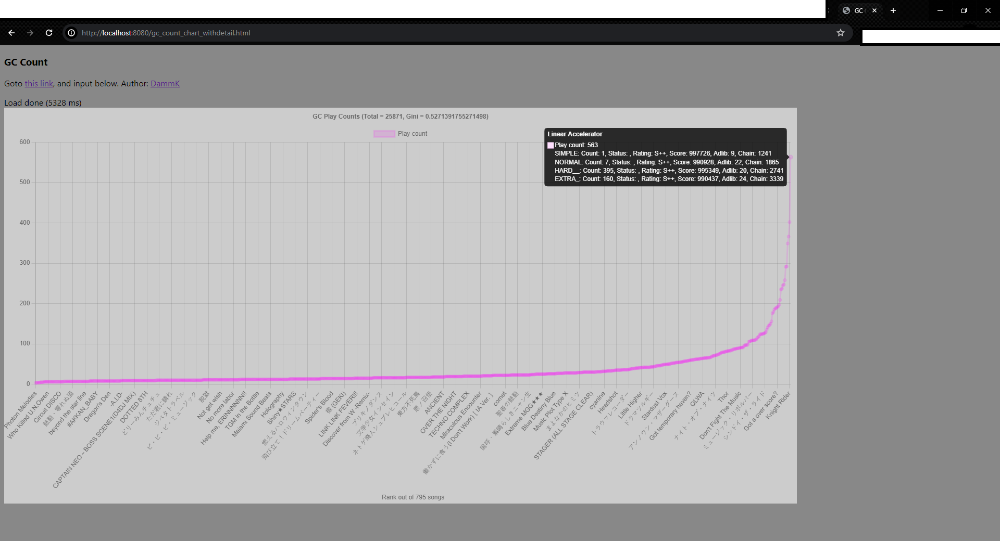
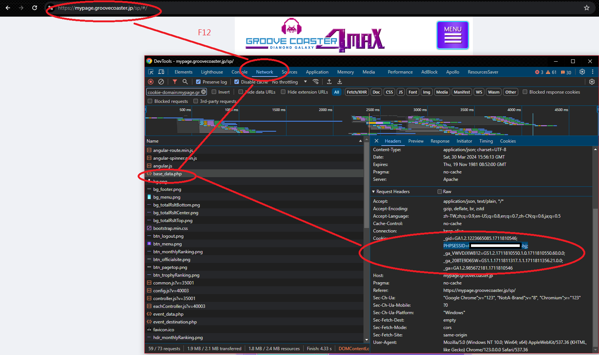

# GC_Count: Groove Coaster personal score archive. #

 

## Readme on 240330 ##

- [RIP.](https://groovecoaster.jp/news/18547.html)

- Since the server may go out without notice, I think I should think to pull the score for myself again.

- This time it is not pure webpage.

### How to start ###

- Login to [mypage](https://mypage.groovecoaster.jp/), do not close after login.

- Find the `cookie`.



- Install [Yarn CLI](https://classic.yarnpkg.com/lang/en/docs/cli/) and [NodeJS](https://nodejs.org/en). *LTS is fine. NodeJS > 12.*

- `yarn` > `yarn start [cookie] [port]` To start. Browser will be opened automcatically.

- Full example: `yarn start "PHPSESSID=xxxxxxxxxxxxxxxxxxxxxxxxxx;" 8080`

- `cookie`: Required. See image above.

- `port`: Default 8080. Optional.

- Score will not update if files are present. Delete whole folder to pull the server again.

### Developer Notice ###

- If mypage is gone, I have made backup (for myself) as `scores.7z`.

- It is done in hurry (frontend = 2 nights, backend = 2 nights). Main purpose is save MY score only. I'm not going to emulate / pull the whole DB for everybody. Tell me if there are something in progress (maybe raise issue). 

- I know there are private cabinets / emulators / analysis on network etc. However I'm not going to be involved.

- *PHP is a bad idea.* 

## Readme on 180902 ##

```
#靠北音Game10062 
課金證明 ( 下線版, 開源 ):
- 先登入 MYPAGE.  
- 之後查閱 https://mypage.groovecoaster.jp/sp/json/music_list.php. 將會是大量火星文.
- 去 https://pastebin.com/A9nwd3bL, 把裹面整個網頁打包.
- 圖表版 (用法一樣): https://pastebin.com/zzj1Bjau
- 把那 PHP 入面所有火星文弄入去, 按一下. 
- 完. 數字為打了幾多道. ( 只包括現時有計算的譜面. )
( chrome 45/ edge/ firefox 22 以上 )
...
以下為技術討論. 
另外還有個可以查分的 ( 但 CORS 就是不能一口氣把所有歌都拿掉 ) 
https://mypage.groovecoaster.jp/sp/json/music_detail.php?music_id=592
查 "朋友" 的
https://mypage.groovecoaster.jp/sp/json/friend_music_list.php?hash=自己找
```